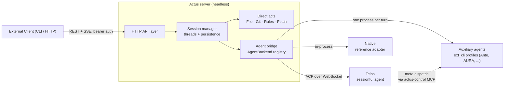
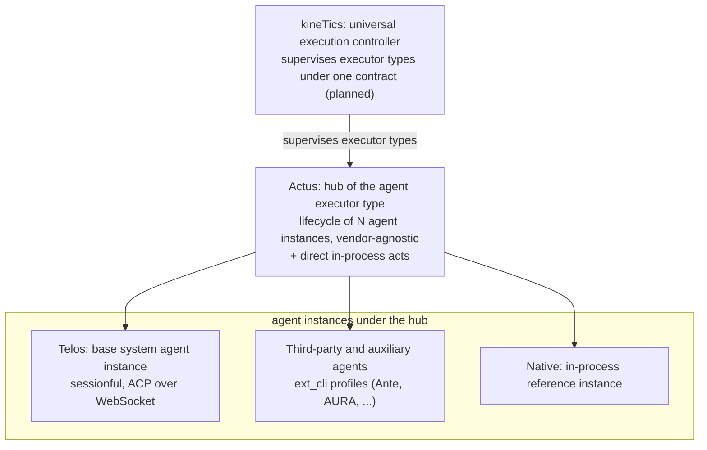

# Actus: the act runtime

Actus is a spatio-temporal runtime that executes acts, directly and through
agents. The name joins act and us: the runtime exists for acts, the way
nex-us exists for knowledge. An act is any unit of execution, from
reading workspace context, editing files, running commands, resolving
symbols, and fetching resources, to driving an agent through a task. An
agentic process is one kind of act, the first implemented kind, and not
the only one.

Actus holds conversation state and workspace context, spawns and routes
agents, persists threads, and exposes one uniform HTTP API. Planning
happens inside the agents: Telos, the default execution agent, converts
plans into system effects. Actus itself binds to no LLM and no agent
implementation; direct acts run in-process and any agent kind attaches
behind the same surface.

## Architecture



Direct acts run inside the server: file search and mention, symbol and
rule lookup, URL fetch behind an SSRF guard, and git status, diff, and
log. Delegated acts run through the agent bridge. Telos is the first
default agent kind: a general agent execution layer that converts plans
into system effects without binding to a language or a domain. The
architecture accepts any act or agent that communicates over a contract,
making actus a universal gateway for execution.

## Execution Fabric

Actus weaves heterogeneous act types behind one thin execution fabric.
Agents are the first implemented family of acts. Any agent platform can
be orchestrated through the same actus surface; Telos is the default
agent.

- `agent::AgentKind`: platform kinds (`telos`, `ext_cli`, `native`,
  `langgraph` declared), extensible by adding a kind and an adapter.
- `agent::AgentBackend`: uniform async trait (`status`, `submit`,
  `cancel`, `cancel_request`, `thread`, `threads`, `subscribe`) implemented
  by every platform adapter.
- `agent::AgentRegistry`: name to running adapter map with a default
  agent.
- `telos::backend::TelosBackend`: first adapter, wrapping `TelosManager`.
  ACP-over-WebSocket details (reconnect, event dispatch) stay inside
  `telos::control`; the adapter owns thread state and command submission.
- `agent::ext_cli`: one-shot raw-CLI adapter that spawns a declared
  binary per turn (probe, per-agent workdir, request-scoped cancel).
- Direct acts: the server performs file, git, rules, fetch, and symbol
  services in-process; they are acts with no agent attached.

HTTP handlers talk only to the `AgentBackend` trait, so a new platform
(LangGraph Server over REST/SSE, an in-process Rust agent, a lightweight
auxiliary agent binary) plugs in by implementing the trait and
registering it. `/v1/health` reports per-agent status in the `agents`
map.

## Kinds of Acts

An agentic process is one kind of act. The taxonomy below separates the
kinds actus runs today from the kinds that arrive with the kineTics
controller, which supervises every executor type under one contract.

| Kind | Meaning | Status |
|---|---|---|
| Direct act | In-process primitives: file search and mention, git status/diff/log, rules, symbols, URL fetch behind an SSRF guard | Implemented |
| Agentic act | Drive an agent process: a sessionful agent (Telos, ACP over WebSocket), a one-shot CLI profile (`ext_cli`: Ante, AURA, ...), or the in-process native reference | Implemented, the first family |
| Control act | Meta dispatch: one agent submits, polls, waits for, and cancels another agent's turn through the policy-gated `actus-control` MCP surface | Implemented for agent controllers |
| Transductive act | Signal receipt and emission through the coordinate substrate (Chton / Tagma Signal) | Under kineTics |
| Materialization act | Physical actuation: FPGA, robot controllers, sensor networks | Under kineTics |
| HMI act | Human input into coordinates and system state back to humans | Under kineTics |
| Bridge act | Interoperability with external distributed systems | Under kineTics |

Each kind stays an act behind the same runtime surface: actus routes it,
holds its state, and reports its outcome, whether the executor is a
process, a transducer, or a human interface.

## Configuration

Agents are declared in `~/.actus/config.toml` (or `ACTUS_CONFIG`). When
the file is absent, a single default `telos` agent is derived from the CLI
flags and environment (`LLM_API_KEY`, `LLM_PROVIDER`, `LLM_BASE_URL`,
`LLM_MODEL`). The LLM layer belongs to the agent processes: actus treats
the endpoint as an OpenAI-compatible API and ships no LLM-specific
provider, model name, or API host of its own. The provider label, model,
and base URL always come from the local environment or the agent's config
entry.

```toml
[[agents]]
name = "telos"             # default agent; routed when no agent is named
kind = "telos"             # telos | langgraph | native (telos default; native is in-process)
provider = "openai-compatible"          # label of the OpenAI-compatible endpoint
model = "example-model"                 # model served by that endpoint (LLM_MODEL)
base_url = "https://api.example.com/v1" # base URL of that endpoint (LLM_BASE_URL)
api_key = "sk-..."                      # key for that endpoint (LLM_API_KEY)
bin = "../telos/target/telos-release/tel"
ws_port = 8080
tool_approval = "always"  # always | ask | never (drives the agent's approval policy)

  # MCP servers attached to this agent (stdio or http)
  [[agents.mcp]]
  name = "filesystem"
  command = "npx"
  args = ["-y", "@modelcontextprotocol/server-filesystem", "./"]

  [[agents.mcp]]
  name = "cloudflare-api"
  url = "https://mcp.cloudflare.com/mcp"

[[agents]]
name = "research"
kind = "telos"
provider = "anthropic"
model = "claude-sonnet-4"
ws_port = 8081
```

Each agent inherits any omitted field from the defaults. Every `telos`
agent needs a unique `ws_port`; thread state is persisted per agent under
`~/.actus/threads/{name}/`. Chat and thread endpoints accept an `agent`
field to route to a specific agent; without it the first configured
agent is the fabric default. MCP servers declared under an agent
are injected into the agent's `context_servers` settings and started by
the headless agent, exposing their tools to the model.

`tool_approval` sets the tool call approval policy. `always` auto-approves
tool calls (headless task execution); `ask` waits for a human or approval
bridge; `never` rejects them. The mode is carried to the agent via the
`TELOS_TOOL_APPROVAL` environment variable.

### Auxiliary Raw-CLI Agents

An `ext_cli` agent attaches any external binary that answers one prompt
per process invocation. Specialized agents attach without code changes:
Ante over its headless `-p` mode, AURA over its standalone `--query`
mode. Declare the agent like any other, with the CLI profile fields
`cli_args`, `cli_env`, `cli_prompt`, and `cli_timeout_secs`.

```toml
[[agents]]
name = "ante"
kind = "ext_cli"
bin = "ante"
cli_args = ["-p", "{prompt}"]   # {prompt} is replaced by the message

[[agents]]
name = "aura"
kind = "ext_cli"
bin = "aura"
cli_args = ["--config", "/path/to/agent.toml", "--query", "{prompt}"]
cli_timeout_secs = 600
```

Per turn actus spawns `bin` with the declared arguments plus the message
(either at the `{prompt}` marker or appended as the final argument), runs
it in the server working directory with the server environment plus
`cli_env`, and records stdout as the assistant reply. A non-zero exit
records the exit code with stderr; a timeout kills the process. A
`cli_env` value of the form `$NAME` is replaced by the whole server
environment variable NAME at spawn time (an unset variable becomes an
empty string, combined forms such as `$A/suffix` stay literal), so
secrets stay out of `config.toml`. `cli_prompt = "stdin"` writes the
message to the child's stdin instead of passing an argument. `workdir`
overrides the server working directory per agent for CLIs that resolve
project scope from the current directory (for
example AURA locating `.aura/permissions.json`); a relative path resolves
against the directory actus was started from, and an unresolvable entry
fails the launch with the agent name.

Raw-CLI agents are one-shot and parallel. Threads stay in memory for the
server lifetime and do not survive a restart. The asymmetry to sessionful
telos agents is deliberate: a raw-CLI turn is a stateless one-shot
process that cannot resume, while telos threads persist to disk under
`~/.actus/threads/{name}/`. Thread management parity (issue #3) decides
whether auxiliary threads persist later. There is no streaming or tool
approval surface, and the model settings live inside the agent's own
configuration, which actus does not read. The profile contract and
integration notes are recorded in
`docs/devlogs/2026-09-06-aux-agent-profiles.md`.

### Meta Agents and the Control Surface

A sessionful agent such as telos can act as a meta agent: dispatch other
agents (Ante, AURA, any `ext_cli` entry) and collect their results.
Telos runs `actus control` as one of its MCP context servers; each MCP
tool call becomes an authenticated actus API call carrying the identity
of the calling agent.

```toml
[[agents]]
name = "telos"
kind = "telos"
# ...existing fields...

  [[agents.mcp]]
  name = "actus-control"
  command = "/absolute/path/to/actus"
  args = ["control"]

[agent-control]
allow = [
  { controller = "telos", targets = ["ante", "aura"] },
]
```

Tools exposed to the meta agent: `agent_list`, `agent_submit`,
`agent_poll`, `agent_wait` (bounded wait for completion), `agent_cancel`,
and `agent_thread`. The launcher exports `ACTUS_AGENT_NAME`,
`ACTUS_HTTP_PORT`, and `ACTUS_API_TOKEN` to agent processes so the proxy
knows where to call and who it is.

Dispatch is default deny: only pairs listed under `[agent-control]` may
run, a controller can never dispatch to itself, and `*` matches any
name. Human API clients carry no identity header and are not gated.
Telos ask-mode approval also applies to the control tool calls themselves
through the existing HITL bridge. See
`docs/devlogs/2026-09-06-meta-agent-control.md` for the design record.

## `@` Mention Context

Typing `@` in the CLI injects context into the message before it is sent,
mirroring Telos's mention picker:

| Form | Source | Example |
|---|---|---|
| `@path/to/file` | file paths auto-injected (top matches) | `@src/server.rs` |
| `@?query` | interactive picker across files, symbols, threads | `@?server` |
| `@rules` | project rule files (AGENTS.md, *.mdc) | `@rules` |
| `@symbol:query` | definition-pattern symbol search | `@symbol:search_symbols` |
| `@thread:query` | conversation thread content | `@thread:thread-title` |
| `@fetch:URL` | fetched URL text | `@fetch:https://example.com` |

Server endpoints: `/v1/symbols?q=`, `/v1/rules`, `/v1/fetch?url=`.
Diagnostics mention is deferred (requires a language server).
Plain `@` mentions stay non-interactive so chat flows smoothly; the
picker opens only for explicit `@?query`.

## Agent Types

The agent family is the first implemented type of act. Sessionful agents
run as external processes behind the registry; one-shot agents are
spawned per turn.

| Agent | Role | Protocol |
|---|---|---|
| Telos | General execution agent: converts plans into system effects across files, commands, and network; sessionful and meta-capable through the control surface | ACP over WebSocket |
| Native | In-process reference adapter: deterministic loop that proves the fabric seam without an external process | in-process |
| Auxiliary (`ext_cli`) | One-shot raw-CLI acts attached by profile; first candidates are Ante (`-p` one-shot) and AURA (`--query` one-shot) | CLI (one process per turn) |
| LangGraph (declared) | Config entries parse; the adapter is not implemented yet and entries are skipped at launch with a warning | REST/SSE (future) |
| (planned) Research Agent | Literature search, experiment design | TBD |
| (planned) Review Agent | Code review, compliance checking | TBD |
| (planned) Deploy Agent | CI/CD, infrastructure management | TBD |

## Getting Started

### Prerequisites

- Rust toolchain
- Python 3.12+
- A built telos binary (build the sibling `telos` repo; default path
  `../telos/target/telos-release/tel`)

### Quick Start

```bash
# Build and start server with interactive CLI
./run.sh

# Run the test suite (static checks, unit and integration tests, HTTP smoke tests)
./run.sh --test

# Start server only (background)
./run.sh --server-only

# Connect CLI to existing server
./run.sh --cli
```

### Docker

```bash
# Build the slim runtime image (default target: actus binary and git only)
docker build -t actus .

# Build the test image used by CI (adds python3, curl, git for run.sh --test)
docker build --target test -t actus:test .
```

Published images are cut on version tags (a versioned image plus `latest`)
or as manual dev snapshots. Development commits publish nothing. Agent
binaries stay separate: actus images never bundle telos or auxiliary
agent executables.

### CI tiers

The workflow in `.github/workflows/ci.yml` runs two tiers:

- `build`: builds the actus test image and runs `run.sh --test` against a
  stub agent (`/bin/true`, no LLM tokens). Fast gate for the Rust unit
  and integration suites and the HTTP endpoints.
- `e2e-real-agent`: runs the same suite against the real headless agent
  binary from the prebuilt telos image `ghcr.io/ssccsorg/telos`. The
  image is pulled, never built here, and the agent runs with the stub
  backend so the tier stays LLM-free while `telos_connected` and
  `agent_ready` reflect a real process. The job needs the published
  image and an `ACTUS_TELOS_PAT` secret (read:packages access); until
  both exist it skips with a notice (telos publish tracking issue).

### API Endpoints

| Endpoint | Method | Description |
|---|---|---|
| `/health` | GET | Server status, per-agent state with capabilities and launch errors |
| `/v1/chat` | POST | Send message, SSE stream response |
| `/v1/chat/async` | POST | Send message, return task id and thread id |
| `/v1/cancel` | POST | Cancel a turn; optional body `{ agent?, request_id? }` scopes the cancel (no body cancels the default agent's whole turn) |
| `/v1/threads` | GET | List conversation threads of one agent |
| `/v1/threads` | POST | Create a fresh thread without a message |
| `/v1/threads/{id}` | GET | Thread messages and metadata (includes the dispatch `parent` when a meta agent created it) |
| `/v1/threads/{id}/poll` | GET | Poll the latest turn until completion |
| `/v1/agents/tool-calls/pending` | GET | Tool-call authorizations awaiting a human decision (ask mode) |
| `/v1/agents/tool-calls/resolve` | POST | Approve or reject a pending tool call |
| `/v1/files` | GET | Search workspace files (direct act) |
| `/v1/files/mention` | GET | File mention for prompt injection |
| `/v1/symbols` | GET | Symbol search (direct act) |
| `/v1/rules` | GET | Project rules (direct act) |
| `/v1/fetch` | GET | Fetch a public URL (direct act, SSRF-guarded) |
| `/v1/git/status` | GET | Git working tree status |
| `/v1/git/diff` | GET | Git diff (unstaged/staged) |
| `/v1/git/log` | GET | Recent commit history |

Chat and thread endpoints accept an `agent` field (query or body) to
route to a specific agent; without it they use the first configured
agent. Requests that carry an `X-Actus-Controller` identity header come
from the `actus control` MCP proxy and are gated by the
`[agent-control]` policy.

### API Authentication

Every endpoint except `/health` requires a bearer token sent as
`Authorization: Bearer <token>`. The server resolves the effective token
in this order: the `--api-token` CLI argument, the `ACTUS_API_TOKEN`
environment variable, the persisted token file `~/.actus/api_token`, or a
freshly generated token. The effective token is written to
`~/.actus/api_token` (mode 0600) at startup, so the CLI and shell
consumers read the same value the server enforces. Authentication is
enabled by default and has no disable switch yet; `/health` stays open so
readiness probes work before a token exists.

Browser access is governed separately. Pass `--cors-origins` with a
comma-separated origin list to allow cross-origin requests from those
origins only. The default (empty) sends no CORS headers, so browsers
enforce same-origin policy.

Consumers on the same machine share the token file: when a second server
instance starts, it overwrites `~/.actus/api_token`, so file-based
consumers may then hold a token valid only for the later instance. The
runtime targets a single local instance.

## Project Structure

```
actus/
├── src/
│   ├── main.rs          Server entry point (also `actus control` subcommand)
│   ├── lib.rs           Library target for the integration tests
│   ├── agent/
│   │   ├── mod.rs       Execution fabric: AgentKind, AgentBackend, AgentRegistry, capabilities
│   │   ├── config.rs    Config loading: agent specs, cli profiles, control policy, LLM env resolution
│   │   ├── ext_cli.rs   ExtCliAgent: one-shot raw-CLI adapter (probe, workdir, cancel)
│   │   └── native.rs    In-process reference adapter
│   ├── server.rs        REST API routes and handlers
│   ├── control.rs       `actus control` stdio MCP proxy for meta-agent dispatch
│   ├── context.rs       Workspace context (symbols, rules)
│   ├── files.rs         File search and mention (direct act)
│   ├── git.rs           Git operations (direct act)
│   └── telos/
│       ├── mod.rs       Telos lifecycle, settings bootstrap, session management
│       ├── backend.rs   TelosBackend adapter (AgentBackend impl)
│       ├── control.rs   WebSocket bridge and event dispatch
│       └── types.rs     Protocol type definitions
├── tests/               Integration suites (agent, config, control, ext_cli, mcp, server, ...)
├── docs/devlogs/        Design and contract records (agent profiles, meta-agent control)
├── runner.py            Server launcher (build + run)
├── terminal.py          Interactive chat CLI
├── run.sh               Gateway: build, test, launch
├── Dockerfile           Multi-stage: toolchain, release, test, runtime targets
└── .github/workflows/
    ├── ci.yml           Test workflow: build tier plus the pull-based real-agent tier
    └── publish-actus-image.yml  Publish runtime image on version tags or manual dispatch
```

## Where Actus Sits in the Stack

[kineTics](https://docs.ssccs.org/projects/kinetics/) is the universal
execution and transduction controller of the stack: it supervises
executor types under one coordinate-based contract, with a planned
status and no implementation yet. Actus is the hub of the agent type
under that supervision. It manages the lifecycle of any agent instance,
vendor-agnostic, with Telos as the base system agent instance among them;
third-party and auxiliary agents attach behind the same hub. Building
actus as the agent supervisor is the first step toward kineTics, and
actus is positioned to become its core implementation.



Agent instances read knowledge from the knowledge plane above to decide
and write execution results back as facts, forming a stigmergic loop
between knowledge and action. Actus stays out of that loop's storage:
its role is execution, as the agent hub of a controller that will also
supervise signal, hardware, human-machine, and bridge executors.

## License

Apache-2.0 (see `LICENSE`). Third-party licenses are reported via
cargo-about; see NOTICE.md. Actus is the execution fabric; it launches
and talks to agent processes over a contract. Agent binaries are separate
projects with their own licenses (Telos is GPL-3.0-or-later) and are not
packaged with actus.
