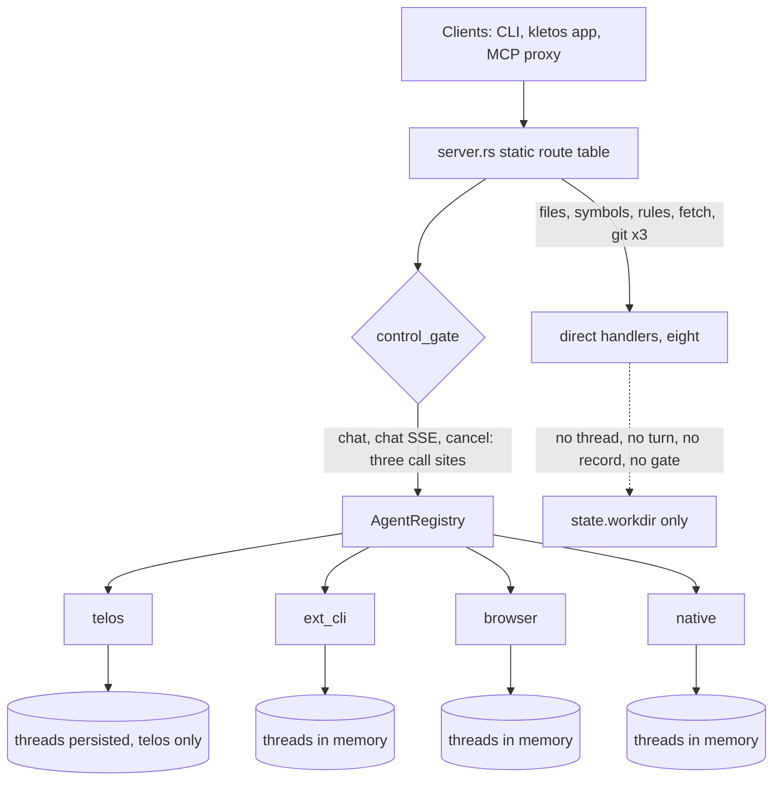

# The act layer, reviewed

## Purpose

This devlog records an integration review of the act layer: whether an act can
be any executor, how the responsibilities are divided between the fabric and a
platform, and how far the design carries a state fabric above it. It was asked
for as an assessment of the adapter seam that issue #36 opened and the browser
kind that issue #37 attached, and it is written to serve issue #14, whose scope
includes keeping the act-first framing code-accurate: the implemented family is
the agent family, and further act types plug in behind the same surface. The
review measured how much of that sentence holds in the code as it is.

Nothing in this review changed code. The recommendations at the end are
proposals, and each carries the counterargument that limits it.

## Method and boundaries

Read first-hand: `src/agent/mod.rs`, `src/agent/adapter.rs`, the README's
Execution Fabric and Kinds of Acts sections, and the devlogs of 2026-08-29
(the nyx wire contract), 2026-09-06 (aux profiles), and 2026-09-30 (adapter
plugins). Scanned with line references, then spot-checked where a conclusion
rests on it: the four adapters' session and turn bookkeeping, every route in
`src/server.rs`, the control surface in `src/control.rs` and
`src/telos/control.rs`, and a case-insensitive sweep of `src/` for record
model vocabulary. The four spot checks that carry the weight are named inline
below. Nothing was executed for this review beyond grep and file reads.

## Verdict

| Axis | Verdict | What it rests on |
|---|---|---|
| Executor-agnostic seam | Strong | A kind is a registered name; a new platform is one factory plus one registration. Five implementations share the launch path, including a test-only one in `tests/adapter_test.rs`. |
| Act uniformity | Partial | `AgentBackend` is the only execution interface, and it is chat-shaped throughout. The eight direct acts sit outside the fabric. |
| Responsibility split | Partial | A platform's options, validation, and lifecycle are properly encapsulated. Session, turn, and persistence bookkeeping is re-implemented per adapter. |
| Extensibility | Strong for agent kinds, absent for the rest | The browser kind cost one module and two lines in `main.rs`. A non-agentic executor needs a new route and a module outside the seam. |
| Substrate for a state fabric | Weak | No fact, derivation, provenance, content hash, or idempotency concept exists in `src/`. The only trace of an act is a chat message. |

The one sentence to keep: the fabric has unified the executors, and has not yet
unified the record of what an act did.

## Interfacing

### What holds

- The layering is right. `AgentBackend` (`src/agent/mod.rs:164`) is implemented
  by every platform; `AgentFactory` (`src/agent/adapter.rs:43`) owns one kind's
  options, validation, and launch; `FactoryRegistry` (`:63`) resolves a kind
  name; `AgentRegistry` (`src/agent/mod.rs:246`) maps names to running agents.
  HTTP handlers talk only to the trait, and the route table is one static
  table (`src/server.rs:1182`).
- `LaunchContext` carries fabric state only (workdir, threads root, HTTP port,
  API token), so a platform's own state stays inside its factory.
- Config is data. `AgentSpec` is `name`, `kind`, `workdir`, and the rest of the
  entry as a table; the fabric never reads a platform field.
- Validation is delegated, and its signature takes the whole spec list
  (`validate(spec, all)`), so a constraint across one kind's agents belongs to
  that kind's factory, as the telos WebSocket port check does.
- An unknown kind is refused at load with the registered kinds named, and a
  reserved kind keeps an older config loading.

### What does not hold

- The execution interface is chat-shaped. `submit(thread_id, message: &str)`
  takes one string, and the result is `ThreadMessage` (`src/agent/mod.rs:124`)
  with `content: String` and free-form `entry_type`, `tool_name`,
  `tool_status`. The browser kind fits this shape by carrying a JSON plan in
  the message and a JSON record in the content. There is no typed payload, no
  typed result, and no discoverable contract for an act's input or output.
- `AgentCapabilities` is decorative on the request path. Its only consumers are
  the four backends' own `status()` methods; no route handler reads it (spot
  check: `grep -rn "capabilities()" src/`). The approval endpoints answer for an
  adapter that declares `approval: false`, and the SSE route opens for one that
  declares `streaming: false`, so the declaration is data rather than a
  contract. Its one real consumer is `GET /health`, and the CLI client reads it
  there.
- The direct acts are outside the fabric. `search_files`, `mention`, `symbols`,
  `rules`, `fetch`, and three git reads read `state.workdir` and execute in the
  handler. None touches a thread, a turn, a record, or the policy gate, and
  `fetch_handler` takes no `State` at all (`src/server.rs:961`), so it cannot
  reach the fabric by construction. The README's promise that each kind stays
  an act behind the same surface, where actus routes it, holds its state, and
  reports its outcome, does not hold for this family.
- The policy gate is asymmetric. `control_gate` has three call sites (chat,
  chat SSE, cancel; `src/server.rs:130`, `:310`, `:350`, `:1155`). Reads,
  thread creation, and the tool-call endpoints are unguarded. The controller
  identity is a plain header, and omitting the header passes the gate
  (`src/server.rs:131-133`), so "who acted" is voluntary metadata rather than a
  recorded fact.
- Provenance is thin. `ThreadParent` (`src/agent/mod.rs:90`) has an agent and a
  thread id and nothing else. It is recorded once per thread, not per turn
  (`src/agent/ext_cli.rs:353-357`, `src/agent/browser.rs:1158-1162`), it is
  discarded by the default kind (`src/telos/backend.rs:129-135`), and the SSE
  path passes `None` (`src/server.rs:354-362`). In a telos-shaped deployment the
  API can build a parent and the backend drops it.
- There is no outcome type. Success and failure are prose: `[ext-cli] exited
  with 3`, or `ok` inside the browser kind's JSON content. A consumer above has
  no field to query.

## Responsibility split

### What holds

- The platform lifecycle moved into the platform's module in #36: the
  WebSocket server, settings bootstrap, thread saver, child process, reconnect
  monitor, and shutdown flush all live in `src/telos/`, and `main.rs` is a
  composition root.
- `LaunchedAgent { backend, children }` makes ownership of child processes
  explicit at launch and at exit.
- `scope()` is an opaque string a backend answers in its own terms, which is
  the right shape for a fabric that does not read it.

### What does not hold

- Session and turn bookkeeping is re-implemented per adapter. The scan measured
  73 lines in `native.rs`, 86 in `ext_cli.rs`, and 85 in `browser.rs` that
  repeat the same shape, about 244 lines in total. The three `blank_session`
  bodies are field-for-field identical, and the three `get_or_create` bodies
  differ only in the thread id prefix (`native-`, `cli-`, `browser-`). The
  fabric supplies the types and none of the store, the session constructor, or
  the completion helper. Telos adds a 120-line persistence layer and five more
  bookkeeping functions on top.
- Durability depends on the act's kind. Telos persists
  `~/.actus/threads/{agent}/threads.json` and repairs it on load (title
  backfill, duplicate message id cleanup, turn counter drift).
  `native.rs`, `ext_cli.rs`, and `browser.rs` keep threads in memory.
  `LaunchContext.threads_root` is handed to all four and read by one.
- Completion semantics diverge: initial `completed` is true for the three
  auxiliary kinds and false for telos; the counter is `+= 1` against
  `wrapping_add(1)`; telos has three terminal paths (normal, error, cancelled)
  behind a sentinel duplicate check, while the auxiliary kinds have one; titles
  truncate at 60 characters against 80 with a suffix; notifications fire at
  turn boundaries against every event. What a thread is gets defined four
  times.
- The turn skeleton is copy-pasted (submit, record the user message, mark
  incomplete, spawn, record the reply, mark complete, notify). The variable
  part is the executor; the invariant part is repeated around it.
- Telos residue remains outside `src/telos/`: `--bin`, `--ws-port`, `--api-key`,
  `--provider`, `--base-url`, `--reasoning-effort`, and the default binary path
  in `main.rs`; `telos_connected` in `/health`, which an external client pins;
  `acp_thread_id` on the shared `ThreadSession`; `thinking_effort` on
  `ChatRequest`. The fabric itself names no platform, but the composition root
  and the shared types still privilege one.
- `shutdown()` was added to the trait in #36, and only telos implements it
  (spot check: one override in `src/telos/backend.rs:337`). The process-spawning
  kinds do not kill their in-flight children on exit, so a server that stops
  can leave a browser or a CLI child running.

## Extensibility

### What holds

- Attaching a platform is cheap and was demonstrated twice in one day: the
  browser kind is one module plus two lines of registration, and the adapter
  test attaches a factory declared in the test crate.
- The registry keeps name order stable, refuses an unknown kind with the
  registered list, refuses duplicate agent names, and treats a missing config
  file as a deliberate empty case rather than a guess.

### What does not hold

- There is no shared test kit. Each adapter test file re-derives a stub binary,
  a log parser, and a turn waiter; `tests/browser_test.rs` is 1,110 lines, a
  large share of it scaffolding rather than contract.
- There is no options schema. An operator learns a kind's fields from the
  README table. Unknown-key refusal is now inconsistent: the browser kind
  denies unknown keys (added in #37) while `ext_cli` and telos still ignore
  them, so a typo fails loudly in one kind and silently in another.
- Adding a non-agentic executor is not a registration. It means a new route and
  a module outside the seam, which is why the direct acts look the way they do.
  The adapter devlog records the project's own position that the kineTics
  executor kinds belong to "the fabric's act taxonomy" rather than to the agent
  registry; that taxonomy is not code yet.
- `LaunchContext` has no resource notion. Telos validates its own port
  collisions inside its factory, which works, but a second kind that needs a
  host-global resource would repeat that logic rather than lease it.
- There is no discovery surface. `FactoryRegistry::kinds()` serves diagnostics,
  and nothing exports the kind list or an options schema for a deployment tool.

## The state fabric question

Against a fact, intent, hint model, the mapping is this.

| Layer | In actus | State |
|---|---|---|
| Intent | `ChatRequest` and the control surface's submit | Present, untyped |
| Hint | `ControlPolicy`, a kind's `ops` or `domains`, the workdir | Partial: policy is per agent pair, never per act or per tool |
| Fact | Nothing. `ThreadMessage` is the only trace, and a direct act leaves none | Absent |

The sweep found no fact, derivation, provenance, content hash, or idempotency
concept in `src/`. Every `replay` in the tree means deduplicating an ACP event
stream, and every `coord` is a comment about a thread window index. What is
missing, concretely:

- Identity for a turn. `request_id` is minted per dispatch; in the auxiliary
  kinds it survives as the assistant message's `message_id`, but it is not
  linked to a parent, has no content hash, and has no coordinate a fabric could
  key on.
- The derivation of an act's inputs. Nothing records which facts a planner read.
  The closest thing in the tree is the browser kind's plan sitting in the user
  message, and that is true only because a plan happens to be a message.
- An outcome model. Success, failure, and side effects are prose.
- Replay and idempotency. There is no path to re-derive an act's output from a
  recorded input, and no field that marks an act as non-deterministic.
- Time and order. `ThreadMessage.timestamp` and array position are all there
  is; `updated_at` is optional and backend-defined.
- A home for non-ACP structure. `tool_name` and `tool_status` are ACP concepts,
  so anything else has to travel in `content`.

Analytic conclusion: the current design is an agent runtime with a uniform
seam. That seam is a necessary condition for the act layer and not a sufficient
one. The shortfall concentrates in two decisions: the execution interface is
chat-shaped and untyped, and the session, turn, and record layer lives in the
adapters instead of the fabric.

## Recommendations

These are value judgments, ordered by leverage, each with the argument against
it.

Lift the session and turn layer into the fabric. A `SessionStore` (constructor,
lookup, persistence policy) plus `begin_turn` and `finish_turn` (completion,
counter, notification, parent recording) would leave an adapter implementing
only "run one turn". The evidence is the 244 duplicated lines and the three-way
divergence in durability, completion, and titles. The counterargument: telos's
semantics (three terminal paths, a sentinel duplicate check, repair on load)
generalize an ACP event model, and a clumsy common layer would regress the
default agent. The staged version absorbs the three auxiliary kinds first and
leaves telos on its own path until the abstraction has proven itself.

Make the declaration a contract. An adapter that declares `approval: false`
should have the approval route answer with a clear refusal rather than an empty
success, and one that declares `streaming: false` should be refused on the SSE
route. The evidence is that the declaration is currently data on the request
path while the CLI client already reads it as intent. The counterargument:
strict refusal can break a client that today calls those routes for every
agent, so the change is a staged one, and the useful middle is to refuse
explicitly rather than to remove the route.

Bring the direct acts into the record. Not by making them `AgentBackend`s, which
would overstate what they are, but by giving the fabric one way to record an
act (`record_act(name, input, outcome)`) and having the executing handlers call
it. The evidence is that the README promises a runtime surface for every kind
and this family has none. The counterargument: read-only lookups dominate these
routes and recording them all would drown the record in autocomplete traffic,
so the real decision is where the line between a lookup and an act runs.

Record provenance per turn. Extend the parent to a per-turn dispatch (controller,
parent thread, request id, time) and write it on the reply message, fixing
telos's discard and the SSE path's `None` at the same time. The evidence is
that a control surface exists whose trace disappears in the deployments that
matter. The counterargument: provenance is only meaningful once the gate is
meaningful, and today the gate is bypassed by omitting a header, so this
recommendation is worth doing together with that one.

Implement `shutdown` for the process-spawning kinds. The hook exists; a stop
should not leave a browser or a CLI child behind. The counterargument: killing
on the exit path can destroy in-flight work, so the policy has to be stated
(kill after the cancel path has run, and accept that a half-filled form stays
half-filled).

Give the adapters a test kit. A shared stub, log parser, and turn waiter would
remove the scaffolding that each new kind re-derives. The counterargument: a
shared integration-test module grows the compile unit and can flatten the
contracts that differ per kind, so only the genuinely shared part belongs
there.

Wait for nexus before inventing the record type. An `ActRecord` with an
identity, an origin, inputs, an outcome, and a hash is the shape this review
would sketch, but the FIH contract is being reworked, and ev has already
deferred the same alignment on the same grounds. The counterargument: waiting
lets the absence harden, so the two recommendations that stand on their own
(the session layer and the structured result) should proceed independently of
that decision.

## Status

Two of the recommendations above have landed on this branch since this review,
and the rest have not:

- The session and turn layer moved into the fabric as `src/agent/session.rs`
  (`ThreadStore`), with the three auxiliary kinds on it and telos untouched
  (`refactor #18: give the auxiliary kinds one session layer, and one way to
  kill a turn's process`). The same change folded the two copies of the group
  kill into `src/agent/process.rs`, and pinned the store's contract in
  `tests/session_test.rs`.
- The exit path stops an auxiliary turn's process
  (`fix #5: stop an auxiliary turn's process on the exit path`). That change
  also moved the signal handler in `main.rs` ahead of the readiness wait, after
  a live measurement showed a SIGTERM inside that window killing the server and
  leaving the child running.

Still open from the list: the direct acts in the record, the adapter test kit,
and the record type that waits on nexus. The other two landed after this review
was written.

- The capability declaration became a contract, the end of a turn became a
  field, and the dispatch of a turn became one too (`feat #39`). A route that
  an agent's declaration excludes is refused in words, `ActOutcome` is written
  on the reply by every kind, and the messages a turn produced carry the
  controller and the thread on the controller that asked. The gate also
  reaches the agent-named routes a controller can call. What this does not
  change: nothing here was run against a live controller pair, so the contract
  is a property of the code and of the route tests in `tests/server_test.rs`,
  not a measurement of a deployment.
- The direct acts stay outside the record, deliberately. The line this review
  called the real decision is drawn where the change is: an act is recorded
  and gated when it changes state, and every handler in that family is a
  lookup. There is nothing to record yet, which is also why the record type
  still waits on nexus.
- The adapter test kit is not built. The counterargument in the recommendation
  above is the reason: the genuinely shared part (a stub binary writer, a log
  waiter) is smaller than the per-kind contracts that differ, and lifting it
  would flatten them. It stays open as a decision rather than as work.
- The read path names the fields of a record by hand (`get_thread`), so a new
  field on `ThreadMessage` does not reach a client until that projection names
  it. The tests caught it here; a projection derived from the type would remove
  the trap.

## What this review did not cover

- Runtime behavior: nothing was executed, so every claim is a property of the
  code as written, not a measurement of a run. The 244-line figure is the
  scan's measurement of repeated blocks, not a refactoring estimate.
- The telos protocol internals, the kineTics controller, and the deployment
  around kletos, except where they appeared as evidence.
- Whether the recommendations are wanted. They are proposals for the work
  tracks named above, and the issues that already carry parts of them are #18
  (aux parity and persistence), #14 (the act-first framing), and #37 (the
  browser kind).

## Contract Pins

- `src/agent/mod.rs`, `src/agent/adapter.rs`: the seam this review assesses.
- `src/server.rs`: the route table, the gate call sites, and the direct
  handlers.
- `README.md`: the Execution Fabric and Kinds of Acts sections whose claims
  this review checks against the code.
